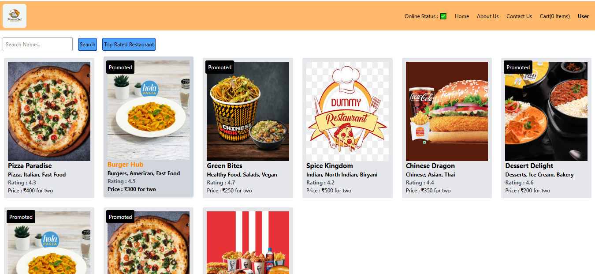
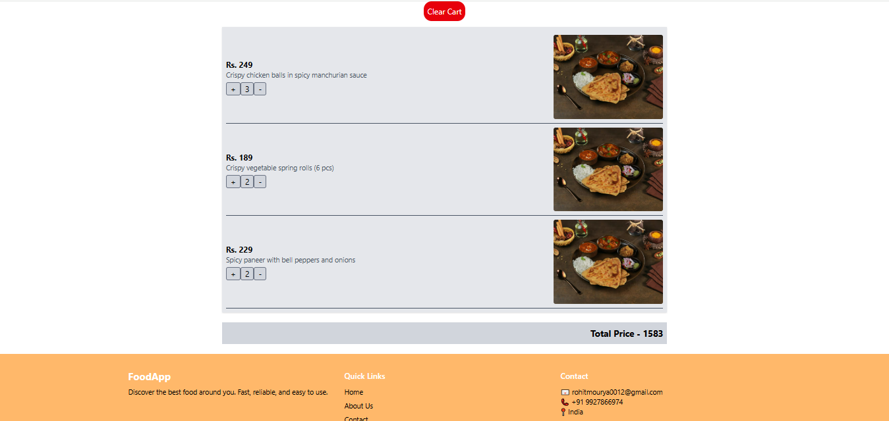
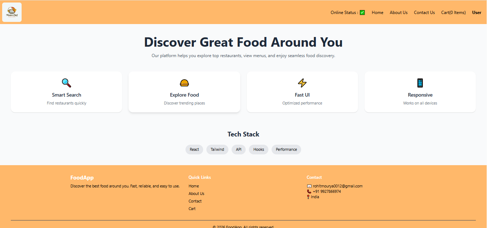

# 🍔 Food Delivery App

A modern and responsive food delivery web application built using React. Users can explore restaurants, view menus, and manage their cart with a smooth and intuitive user experience.

---

## 🎥 Demo Video

[▶ Watch Demo](https://drive.google.com/file/d/12bFSZJtDmu_-F9mHev9PolYXri_9twmP/view)

---

## 📂 GitHub Repository

https://github.com/MrRohitMI/food-delivery-app 

---

## ✨ Features

- 🔍 Search restaurants dynamically  
- 🍽️ Browse restaurant menus  
- 🧾 View detailed food items  
- 🛒 Add, remove, and manage cart items  
- ⚡ Shimmer UI for loading states  
- 🚨 Error handling for API failures  
- 📱 Fully responsive design (mobile & desktop)  
- ⚡ Lazy loading for optimized performance  

---

## 🧠 Tech Stack

- React.js  
- Tailwind CSS  
- React Router DOM  
- Redux Toolkit  
- Vite  

---

## 📁 Project Structure
src/
├── assets/
├── components/
├── utils/
├── App.jsx
├── main.jsx

---

## ⚙️ Installation & Setup

git clone https://github.com/MrRohitMI/food-delivery-app 

cd your-repo
npm install
npm run dev

---

## 📸 Screenshots

| Home |
|------|
|  |
|------|
|  |
| Cart |
|------|
|  |
| About Us |
|------|
|  |
|------|
|  |

---

## 📈 Performance & UX Improvements

- Implemented lazy loading using React.lazy and Suspense  
- Added shimmer UI for better loading experience  
- Optimized component rendering  
- Reusable component-based architecture  
  

---

## 🔮 Future Enhancements

- 🔐 User authentication (Login/Signup)  
- ⭐ Favorites / Wishlist  
- 📍 Location-based restaurant suggestions  
- 💳 Online payment integration  

---

## ❗ Note

This project is not deployed due to API/configuration limitations, but it runs smoothly in the local development environment. A demo video is provided above.

---

## 👨‍💻 Author

Rohit Mourya  
LinkedIn: https://linkedin.com/in/rohit-mourya 
GitHub: https://github.com/MrRohitMI

---

## ⭐ Support

If you like this project, give it a ⭐ on GitHub!